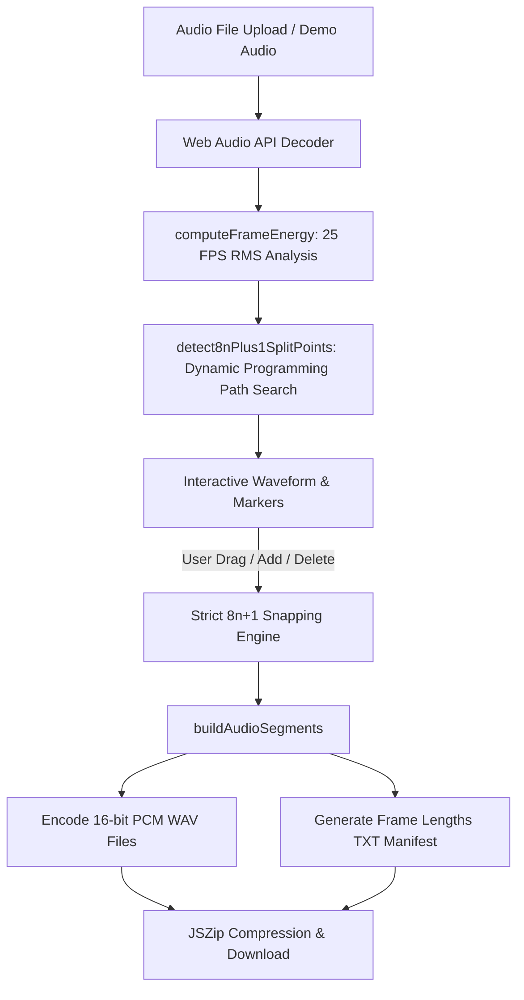

# AudioSplitter (25 FPS 8n+1)

An interactive web application designed for audio segmentation strictly aligned to **25 FPS $8n+1$ frame length rules**, featuring automated silence detection and real-time interactive manual split point overrides.


---

## 📖 Table of Contents
- [Background & Motivation](#-background--motivation)
- [Mathematical Specification & 8n+1 Rules](#-mathematical-specification--8n1-rules)
- [Features](#-features)
- [Architecture & Processing Pipeline](#-architecture--processing-pipeline)
- [Getting Started](#-getting-started)
- [Usage Guide](#-usage-guide)
- [Output Formats & Exporting](#-output-formats--exporting)
- [Project Structure](#-project-structure)
- [License](#-license)

---

## 🎯 Background & Motivation

In 2D/3D animation pipelines, frame-by-frame animatics, lip-sync workflows, and video synchronization, frame lengths often follow repetitive hold/loop patterns. A common standard is the **25 FPS $8n+1$ frame length rule**, where audio segments must span a total duration corresponding to $N = 8n + 1$ video frames (e.g., $1, 9, 17, \dots, 81, 89, 97, 129, 177$ frames).

This application automates the process by finding natural pauses or silent moments near candidate $8n+1$ boundaries, while giving animators and sound editors full visual control to drag, add, remove, or snap split points on a live waveform.

---

## 📐 Mathematical Specification & 8n+1 Rules

### 1. Frame & Sample Conversions
* **Frame Rate**: $25 \text{ FPS} \implies T_{\text{frame}} = \frac{1}{25} \text{ s} = 0.04 \text{ s} = 40 \text{ ms}$.
* **Samples per Frame ($S_{\text{frame}}$)**:
  * For $44.1 \text{ kHz}$ audio: $44,100 / 25 = 1,764 \text{ samples/frame}$.
  * For $48.0 \text{ kHz}$ audio: $48,000 / 25 = 1,920 \text{ samples/frame}$.
  * For $96.0 \text{ kHz}$ audio: $96,000 / 25 = 3,840 \text{ samples/frame}$.

### 2. Segment Duration Formula
Every split segment duration in frames must satisfy:
$$N_{\text{frames}} = 8n + 1, \quad \text{where } n \in \mathbb{Z}_{\ge 0}$$

For the default **3 to 7 second** segment target range ($75$ to $175$ frames), the valid $8n+1$ frame lengths are:

| $n$ | Frame Count ($N$) | Duration (25 FPS) |
|---|---|---|
| $n=9$ | $73$ frames | $2.920 \text{ s}$ |
| $n=10$ | $81$ frames | $3.240 \text{ s}$ |
| $n=11$ | $89$ frames | $3.560 \text{ s}$ |
| $n=12$ | $97$ frames | $3.880 \text{ s}$ |
| $n=13$ | $105$ frames | $4.200 \text{ s}$ |
| $n=14$ | $113$ frames | $4.520 \text{ s}$ |
| $n=15$ | $121$ frames | $4.840 \text{ s}$ |
| $n=16$ | $129$ frames | $5.160 \text{ s}$ |
| $n=17$ | $137$ frames | $5.480 \text{ s}$ |
| $n=18$ | $145$ frames | $5.800 \text{ s}$ |
| $n=19$ | $153$ frames | $6.120 \text{ s}$ |
| $n=20$ | $161$ frames | $6.440 \text{ s}$ |
| $n=21$ | $169$ frames | $6.760 \text{ s}$ |
| $n=22$ | $177$ frames | $7.080 \text{ s}$ |

---

## ✨ Features

- 🔊 **Multi-Format Audio Import**: Drag & drop support for WAV, MP3, FLAC, OGG, AAC, and M4A audio files.
- 🧮 **Sample-Exact 25 FPS Engine**: Computes exact sample indices for any input sample rate without cumulative drift.
- 🤖 **Dynamic Programming Silence Detection**: Automatically evaluates RMS energy for quiet regions / pauses to place split points at optimal low-volume frames.
- 🎛️ **Interactive Canvas Waveform**:
  - Live color-coded segment visualization (green for valid $8n+1$, red warning for non-$8n+1$).
  - Drag vertical markers with optional strict snapping to the nearest valid $8n+1$ grid offset.
  - Double-click waveform to insert a split marker.
  - Playhead scrubbing, zoom controls (100%–500%), and time ruler.
- 📋 **Segment Data Table**: Real-time table showing segment filename (`[origfilename]_0001.wav`), time range, exact frame count, $8n+1$ status badge (`✓ 8n+1 (n=15)`), and average RMS volume.
- 📦 **Batch Export**:
  - Exports split audio as 16-bit PCM `.wav` files.
  - Generates a frame length manifest text file (`[origfilename]_frame_lengths.txt`).
  - Bundles all `.wav` files + `.txt` manifest into a single ZIP archive.
- 🧪 **Synthesized Demo Mode**: Load a built-in synthesized voice/speech demo track instantly to test out-of-the-box.

---

## 🏗️ Architecture & Processing Pipeline



---

## 🚀 Getting Started

### Prerequisites
- **Node.js**: v18.0+ (Tested on Node v25.2)
- **npm** or **pnpm** / **yarn**

### Installation & Execution

1. Clone or navigate to the project folder:
   ```bash
   cd audio-split
   ```

2. Install dependencies:
   ```bash
   npm install
   ```

3. Start the local development server:
   ```bash
   npm run dev
   ```

4. Open your browser and navigate to `http://localhost:3000`.

### Building for Production

To create an optimized production build:
```bash
npm run build
```
The compiled assets will be located in the `dist/` directory.

### 🖥️ Standalone macOS App (Tauri)

The same front-end ships as a native macOS app via Tauri 2 (system WKWebView, ~10 MB bundle). Requires the Rust toolchain (`rustup`/Homebrew `rust`) and Xcode CLT.

```bash
npm run app:dev     # native window with Vite hot reload (port 3000)
npm run app:build   # production .app + .dmg
```

Build artifacts:
- `src-tauri/target/release/bundle/macos/AudioSplitter.app`
- `src-tauri/target/release/bundle/dmg/AudioSplitter_*.dmg`

Desktop-specific behavior:
- **Exporting** (WAV / TXT / ZIP) opens the native macOS save panel instead of a browser download; the ZIP flow also writes the `_frame_lengths.txt` manifest next to the chosen ZIP automatically.
- **Fonts** (Inter, JetBrains Mono) are self-hosted in `public/fonts/` — the app renders identically offline.
- The app is **ad-hoc signed**, so it runs on the build machine without an Apple Developer account. To distribute to other Macs, sign + notarize with a Developer ID (`tauri.conf.json` → `bundle` settings, or `Apple Developer account`).
- HTML5 drag & drop is enabled natively in the webview (`dragDropEnabled: false` in `src-tauri/tauri.conf.json` so file drops reach the React dropzone).

---

## 🕹️ Usage Guide

1. **Upload Audio**: Drag and drop an audio file onto the dropzone or click **"Load Synthesized Demo Audio Track"**.
2. **Review Auto-Splits**: The application will automatically calculate silence split points that conform to 25 FPS $8n+1$ rules.
3. **Adjust / Override Splits**:
   - Drag any vertical marker line left or right to move the split point.
   - If **"Strictly snap dragged markers to 25 FPS 8n+1 grid"** is checked, markers will automatically snap to valid $8n+1$ frame counts relative to the preceding split point.
   - Double-click on the waveform canvas to create a new split point.
   - Select a marker and click **"Delete Selected"** to remove it.
4. **Preview Audio**: Click the **Play** button on the toolbar to preview the full audio or click the small **Play** icon next to any segment in the table to hear that specific clip.
5. **Export Files**:
   - Click **"Export All"** to download a ZIP archive containing all `[origfilename]_0001.wav` files and the `[origfilename]_frame_lengths.txt` manifest.
   - Click **"Export Frame Lengths (.txt)"** to download only the text manifest.

---

## 📄 Output Formats & Exporting

### Filename Pattern
Generated segment files are named sequentially using 4-digit zero-padded suffixes:
```
my_audio_track_0001.wav
my_audio_track_0002.wav
my_audio_track_0003.wav
...
```

### Frame Manifest Format (`[origfilename]_frame_lengths.txt`)
The text file manifest includes human-readable details as well as a raw integer frame list for downstream automation or scripting:

```text
# 25 FPS Audio Segment Frame Length Manifest
# Original File: dialogue_take1.wav
# Total Segments: 3
# Format: [Filename] -> [Frames at 25 FPS] (Duration, 8n+1 Status)

dialogue_take1_0001.wav: 129 frames (5.160s, 8n+1 n=16)
dialogue_take1_0002.wav: 113 frames (4.520s, 8n+1 n=14)
dialogue_take1_0003.wav: 97 frames (3.880s, 8n+1 n=12)

# Raw Frame Counts (one integer per line):
129
113
97
```

---

## 📁 Project Structure

```
audio-split/
├── index.html                 # Main HTML template
├── package.json               # NPM dependencies & scripts
├── tsconfig.json              # TypeScript configuration
├── vite.config.ts             # Vite bundler settings
├── src/
│   ├── App.tsx                # Root React component & audio state controller
│   ├── main.tsx               # Application entry point
│   ├── index.css              # Global styles, dark glassmorphism theme
│   ├── components/
│   │   ├── Header.tsx         # Top application header & metadata bar
│   │   ├── AudioUploader.tsx  # Drag & drop upload zone & demo loader
│   │   ├── WaveformViewer.tsx # Canvas waveform editor & marker drag handles
│   │   ├── ControlPanel.tsx   # Frame range sliders, auto-detection & export buttons
│   │   └── SegmentList.tsx    # Data table of segments with preview controls
│   ├── types/
│   │   └── audio.ts           # Interfaces for SplitMarker, AudioSegment, SplitSettings
│   └── utils/
│       ├── audioMath.ts       # 25 FPS 8n+1 mathematical conversion functions
│       ├── silenceDetector.ts # Dynamic Programming silence split point algorithm
│       ├── wavExporter.ts     # 16-bit PCM WAV encoder & ZIP/TXT exporter
│       └── demoAudio.ts       # Synthesized voice/pause audio buffer generator
├── README.md                  # Project documentation
├── CHANGELOG.md               # Version history
└── AGENTS.md                  # Development guidelines for AI coding agents
```

---

## 📜 License

MIT License. Free for personal and commercial use in animation, video editing, and audio processing pipelines.
